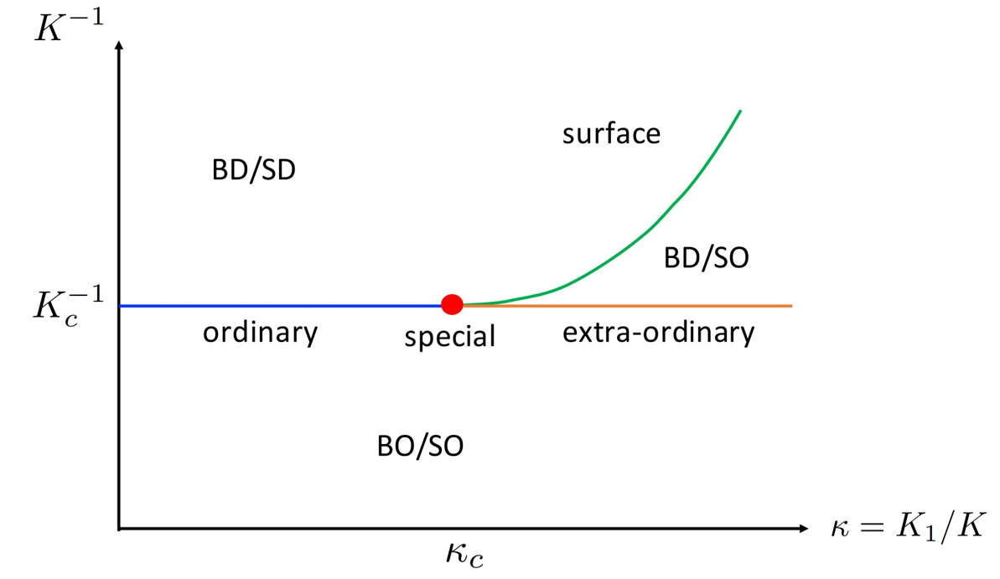



I am a dissertation-year PhD candidate and Presidential Fellow at the Ohio State University. The unifying theme of my research has been to exploit the power of conformal symmetry in explaining critical phenomena in quantum systems. Specifically, I have utilized the tools of numerical and analytical conformal bootstrap to explore the space of quantum critical phenomena and conformal field theories (CFTs) that describe them. I am broadly interested in criticality across nature, and the predictive power of symmetries in studying it.

O(N) vector models with a boundary
======
 | In an ongoing project with my collaborators including Max Metlitski (MIT) and Marco Meineri (University of Turin), I have been studying the boundary criticality in O(N) vector models in 3d. O(N)-vector models, especially the Ising (O(1)), the x-y (O(2)) and the Heisenberg (O(3)) have been canonically used to describe and study phase transitions in a diverse class of systems, including quantum magnets, superfluids and superconductors. Using conformal invariance, we rigorously checked and proved the existence of an earlier-predicted extraordinary-log phase in the O(3) and O(4) models [1]. In this phase, the system is critical in the bulk but the correlations of the order parameter on the boundary decay logarithmically slowly (the boundary is almost, but not quite ordered):  
$$\langle \vec{S}(\vec{x})\vec{S}(\vec{y})\rangle \sim \frac{1}{(\mathrm{log}|\vec{x} - \vec{y}|)^{q(N)}}.$$  
Our main finding was that the O(3) (Heisenberg) model, that describes many real-world magnets, exhibits this phase, which makes it relevant to experiments and numerics. We argued that if the surface coupling is sufficiently enhanced, either due to natural reasons or artificially enforced by depositing another magnetic material with higher Tc, it would be possible to observe the sharp onset of surface magnetization below the bulk Tc. Since our work was published, the logarithmic decay has been directly observed in Monte Carlo simulations of the O(N) vector models [2], and it has been noted that it could be observed at the quantum critical point of the 2+1-dimensional O(N) model under decoherence/weak measurement [3]. 

